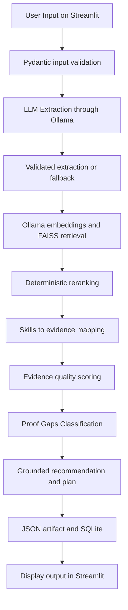

# PROVE – Proof Builder 

## Project selected

I selected the **Proof Builder/Evidence Intelligence** project.

The project addresses a simple career problem: a person may claim a skill, but a claim is not the same as proof. This application helps a user turn experience, project details and evidence references into a structured proof artifact that can be reviewed and improved.

## What this application does 

The user enters following information:

- target role and domain
- claimed skills
- experience
- project information
- available evidence, such as a GitHub repository, certificate or report
- evidence supporting an impact claim
- a declaration explaining whether AI was used

The system then uses:

1. the local `gemma2:2b` model through Ollama to understand the written experience
2. local FAISS RAG over curated role/skill standards to ground expectations and recommendations
3. extracts actions, tools, outputs, outcomes and ownership
4. validates the extracted structure with Pydantic
5. maps claimed and role-required skills
6. classifies each skill as **Proven**, **Implied**, **Claimed** or **Unproven**
7. calculates seven evidence-quality scores
8. identifies proof gaps and creates recommendations
9. generates a practical proof plan
10. saves the final artifact in SQLite 
11. allows the user to download the artifact as JSON.

The LLM is used for understanding language. Python rules control the final evidence, skill status and scores. This reduces the risk of invented facts.

## Main features

- Simple Streamlit interface
- Local LLM through Ollama; no paid API used
- Structured LLM output using a Pydantic JSON schema extraction
- Safe fallback when Ollama is unavailable or returns invalid JSON
- Case-insensitive skill aliases:
  - `ML` and `Machine Learning`
  - `DL` and `Deep Learning`
  - `NLP` and `Natural Language Processing`
  - `GenAI` and `Generative AI`
- Skill levels from `L0` to `L3`
- Four proof statuses
- Seven evidence-quality dimensions
- Skill-specific recommendations and proof plans
- SQLite persistence
- JSON download
- Automated unit tests with a mocked LLM response
- FAISS retrieval with transparent second-stage reranking
- Retrieved source IDs and scores in the final artifact
- 25-query labelled RAG evaluation dataset and evaluation script
- Safe RAG fallback that preserves the original pipeline

## RAG setup and evaluation

Install dependencies and pull both local models:

```powershell
python -m pip install -r requirements.txt
ollama pull gemma2:2b
ollama pull nomic-embed-text
```

Run the application:

```powershell
python -m streamlit run app.py
```

Run retrieval evaluation:

```powershell
python evaluate_rag.py
```

See `RAG_HALLUCINATION_AND_EVALUATION.md` for hallucination risks, controls, pipeline placement and metric explanations.

## Proof-status meaning

| Status | Meaning |
|---|---|
| Proven | The skill is described in the work and evidence is available. |
| Implied | The skill is described, but supporting evidence is not available. |
| Claimed | The user claims the skill, but the work description does not demonstrate it. |
| Unproven | The target role expects the skill, but it is neither claimed nor demonstrated. |

## Evidence-quality scores

The application calculates these seven scores from `0` to `100`:

| Score | What it measures |
|---|---|
| Relevance | How many mapped skills are supported by the supplied work. |
| Depth | Detail in the description and the number of extracted actions. |
| Ownership | Whether ownership is High, Medium, Low or Unknown. |
| Outcome | Whether clear outcomes are described. |
| Verifiability | Whether evidence and impact evidence are available. |
| Recency | How recent the experience is when a date is supplied. |
| Transferability | Whether demonstrated skills can be used across different roles. |

The average becomes the overall evidence-quality score:

- **Strong:** 75 or above
- **Moderate:** 50 to 74.99
- **Weak:** below 50

## Technology used

| Technology | Purpose |
|---|---|
| Python 3.13 | Main programming language |
| Streamlit | User interface |
| Ollama | Runs the LLM locally |
| Gemma 2 2B | Extracts structured meaning from free text |
| nomic-embed-text | Creates local query and document embeddings |
| FAISS | Retrieves similar role and skill standards |
| NumPy | Handles embedding vectors |
| Pydantic | Validates input and LLM output |
| SQLite | Stores generated proof artifacts |
| unittest | Runs automated tests |

## Project structure

```text
Proof_Builder_Project/
├── app.py                         # Streamlit application
├── evaluate_rag.py                # Offline RAG evaluation
├── requirements.txt              # Python dependencies
├── README.md                      # Setup and project documentation
├── architecture.md                # Architecture and design decisions
├── data/
│   ├── prove_evidence.json        # Sample evidence dataset
│   ├── role_skill_standards.json  # Curated RAG knowledge base
│   ├── rag_evaluation.json        # Labelled retrieval test set
│   └── proof_builder.db           # SQLite database created/used locally
├── src/
│   ├── models.py                  # Pydantic data models
│   ├── llm_extraction.py          # Gemma extraction and guardrails
│   ├── rag_retrieval.py           # FAISS retrieval and reranking
│   ├── skill_mapping.py           # Skill aliases and proof statuses
│   ├── scoring.py                 # Seven evidence-quality scores
│   ├── proof_gaps.py              # Proof-gap records
│   ├── proof_recommendations.py   # Improvement recommendations
│   ├── proof_plan.py              # Practical proof plan
│   ├── proof_artifact.py          # Final artifact structure
│   ├── storage.py                 # SQLite save and retrieval logic
│   └── pipeline.py                # Connects all processing steps
└── tests/
    └── test_core.py               # Core unit and evaluation tests
```

## Architecture summary




## Setup on Windows with Python 3.13

### 1. Open the project folder

Open PowerShell in the folder containing `app.py`, `src` and `tests`.

### 2. Create a virtual environment

```powershell
python -m venv .venv
```

### 3. Activate it

```powershell
Set-ExecutionPolicy -Scope Process -ExecutionPolicy Bypass
.\.venv\Scripts\Activate.ps1
```

### 4. Install Python packages

```powershell
python -m pip install --upgrade pip
python -m pip install -r requirements.txt
```

### 5. Install and prepare Ollama

Install Ollama from [ollama.com/download](https://ollama.com/download), then run:

```powershell
ollama pull gemma2:2b
ollama pull nomic-embed-text
```

Check that the model is available:

```powershell
ollama list
```

Keep the Ollama application running while using the project.

## Run the application

```powershell
python -m streamlit run app.py
```

Open the local address displayed in PowerShell, normally:

```text
http://localhost:8501
```

## How to use it
Note: Enter in plain text, no inverted commas or any other format.
1. Enter a target role and domain.
2. Enter claimed skills separated by commas.
3. Explain how the skills were used in the experience or project.
4. Add evidence references, one per line.
5. Select the AI-use declaration.
6. Click **Analyse and build proof**.
7. Review the Skill Map, Quality, Proof Gaps, Proof Plan and Final Artifact tabs.
8. Download the artifact as JSON.

For a skill to become **Proven**, mentioning it only in the claimed-skills box is not enough. Its use must also be described in the experience or project, and evidence must be supplied.

## What type of input should the user provide?

The application works best with **real, specific and evidence-based career information**. The user should describe what they personally did, which tools they used, what they created and what result they achieved.

Avoid entering random text or only listing skill names. The application cannot build strong proof when the work is not explained.

This project is applicable for only five roles.
1. Data Analyst, 
2. Junior Data Analyst, 
3. Data Scientist, 
4. Back End Developer, 
5. Project Manager

### Input-field guide

| Field | What the user should enter | Example |
|---|---|---|
| Target role | The job the user is preparing for | `Junior Data Analyst` |
| Target domain | The industry or business area | `Retail`, `Finance`, `Healthcare` |
| Claimed skills | Skills separated by commas | `Python, SQL, Excel, Power BI` |
| Project name | A short, meaningful project title | `Retail Sales Analysis` |
| Project description | The problem, data and purpose of the project | `Analysed store sales data to identify low-performing products and monthly trends.` |
| Experience description | The user's actions, ownership, tools, outputs and outcomes | `I cleaned sales data using Python, wrote SQL queries and created a Power BI dashboard for monthly reporting.` |
| Evidence references/links | Existing proof, one item per line | `GitHub repository`, `Dashboard screenshot`, `Manager-approved report` |
| Impact evidence | Proof supporting a measurable result, one item per line | `Before-and-after report`, `Performance review`, `Analytics screenshot` |
| AI-use declaration | How AI was used during the work | `None`, `AI-assisted`, `AI-generated` or `AI-dependent` |

### What should an experience description contain?

A useful description should answer five simple questions:

1. **Context:** Where or why was the work done?
2. **Action:** What did the user personally do?
3. **Tools:** Which skills or technologies were used?
4. **Output:** What was created?
5. **Outcome:** What changed or improved?

A simple writing pattern is:

```text
I used [skill/tool] to perform [action] for [project or business problem].
I created [output]. This resulted in [outcome], supported by [evidence].
```

### Complete example of good input

```text
Target role:
Junior Data Analyst

Target domain:
Retail

Claimed skills:
Python, SQL, Excel, Power BI, Statistics

Project name:
Retail Sales Performance Dashboard

Project description:
Analysed store-level sales data to identify monthly trends, weak product
categories and differences between regions.

Experience description:
I cleaned missing and duplicate sales records using Python and Excel. I wrote
SQL queries to combine order, product and customer tables. I created Power BI
measures and an interactive dashboard showing revenue, profit and regional
performance. I presented the findings to the reporting manager and recommended
focusing on three low-performing product categories.

Evidence references/links:
GitHub repository containing the Python notebook and SQL queries
Power BI dashboard screenshots
Project README
Presentation reviewed by the reporting manager

Evidence supporting the impact:
Improved a key business metric by 17%.

AI-use declaration:
AI-assisted
```

This input can support Python, SQL, Excel and Power BI because their use is clearly described. Evidence references are also available, so demonstrated skills may receive a stronger proof status.

### Weak input versus useful input

| Weak input | Why it is weak | Better input |
|---|---|---|
| `I know Python and SQL.` | It only claims skills. | `I used Python to clean sales data and SQL to join order and customer tables.` |
| `Worked on a dashboard.` | It does not show the tool or personal contribution. | `I created a Power BI dashboard with DAX measures for revenue and profit.` |
| `Improved performance by 40%.` | The number has no explanation or evidence. | `Reduced monthly reporting time from 10 hours to 6 hours; supported by the before-and-after report.` |
| `Team completed the project.` | Personal ownership is unclear. | `I was responsible for data cleaning, SQL queries and dashboard validation.` |
| Random or meaningless text | The LLM cannot extract genuine career proof. | Enter a factual description of real work or a real learning project. |

### Evidence the user can provide

Evidence can include:

- GitHub repository or code sample;
- notebook, SQL script or dashboard file;
- README explaining the project;
- report, presentation or screenshot;
- certificate linked to practical work;
- manager, mentor or client confirmation;
- performance review;
- safe sample dataset;
- before-and-after measurements; or
- a published article, portfolio page or project link.

Do not include passwords, confidential company data, private customer information or files that the user is not allowed to share. Use anonymised or safe sample data where necessary.

### How the input affects the result

- A skill entered only under **Claimed skills** is normally classified as **Claimed**.
- A skill described in the experience/project without evidence can be **Implied**.
- A skill described in the work with available evidence can be **Proven**.
- A skill expected for the target role but neither claimed nor described is **Unproven**.
- Specific actions improve the depth assessment.
- Clear ownership improves the ownership assessment.
- Outcomes improve the outcome assessment.
- Evidence references improve verifiability.
- Unsupported percentages are reported as unsupported claims.

## Tests and evaluation cases

The tests mock `ollama.chat`, so they do not send test prompts to the real model. The `ollama` Python package must still be installed because the project imports it.

Run all current tests:

```powershell
python -m tests.test_core
```

Alternative discovery command:

```powershell
python -m unittest discover -s tests -v
```

Current evaluation cases:

| Test | What it checks |
|---|---|
| Successful extraction | Valid structured LLM output receives `success`. |
| Invalid LLM output | Invalid JSON produces a safe `fallback`. |
| Claimed and Proven statuses | Described SQL with evidence is Proven; undescribed Python is Claimed. |
| All proof statuses | Proven, Implied, Claimed and Unproven can all be represented. |
| Seven quality dimensions | Every required scoring dimension is returned. |
| Unsupported percentage | A percentage without impact evidence is reported as unsupported. |
| RAG boundary | Retrieved standards cannot override deterministic proof status. |
| FAISS reranking | Relevant RAG standard is ranked above weaker candidates. |

Expected result:

```text
......
----------------------------------------------------------------------
Ran 8 tests

OK
```

## AI and LLM usage

AI coding assistance was used to help:

- explain and simplify parts of the Python code especially streamlit;
- improve comments and documentation;
- review the implementation against the assignment requirements.

The application itself uses the local `gemma2:2b` model to extract structured information from the user's free-text experience. The model does not decide the final scores. Pydantic and deterministic Python rules validate and control the final result. The code and outputs were reviewed and tested before submission.

## Design choices

- **Streamlit instead of React:** keeps the project local, simple and suitable for the requested no-React interface.
- **Direct Python pipeline instead of an API:** the current application does not require FastAPI or external endpoints.
- **Local Gemma through Ollama:** improves privacy and removes the need for a paid cloud LLM API.
- **Python guardrails after LLM extraction:** prevent the model from adding evidence and identify unsupported percentages.
- **RAG as enrichment only:** retrieved standards improve role context and recommendations but do not control proof status or scores.
- **SQLite:** appropriate for a small local demonstration and requires no separate database server.

## Current limitations

- Evidence references are recorded but their contents are not automatically verified.
- Available evidence is treated as general evidence; it is not matched to individual files by content.
- Skill mapping uses a small role catalogue and keyword/alias matching.
- The local 2B model may miss complex or indirect details.
- Skill depth is estimated using simple rules, including description length.
- Recency remains neutral when no experience date is supplied.
- The curated RAG knowledge base and 25-query evaluation set are intentionally small and should be expanded.
- Authentication, file uploads and multi-user access are not implemented.
- Human review is still required before treating an artifact as verified career evidence.

## Possible future improvements

- Upload and inspect evidence files securely.
- Connect each evidence item to the exact skill it supports.
- Expand the role-to-skill catalogue.
- Add configurable scoring weights.
- RAG over a small role/skill dataset
- Resume bullet generation
- Evaluation dataset
- LLM cost tracking
- Background processing
